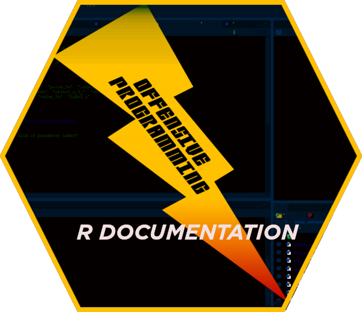
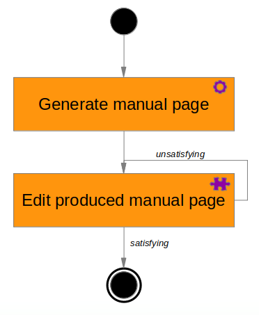
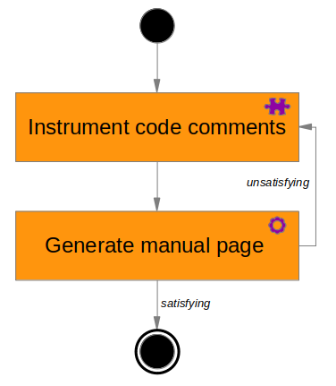
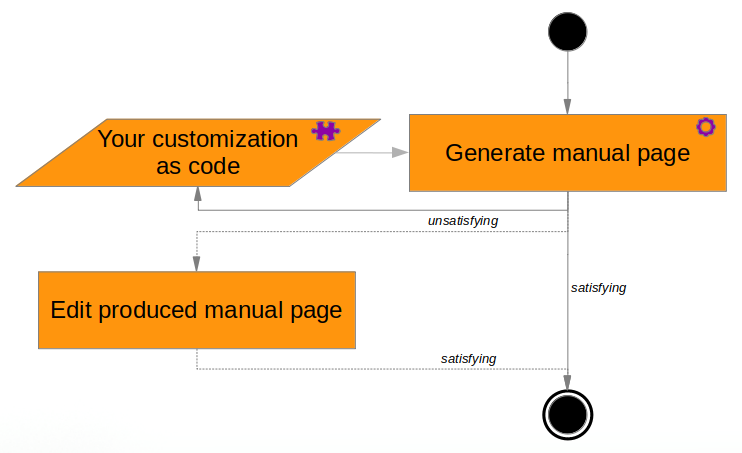

<link rel="stylesheet" href="style.css">



```{r setup, include = FALSE}
knitr::opts_chunk$set(
  collapse = TRUE,
  comment = ""
)
source('vignette-common.R')
```


Package `r rdoc` aims to ease manual page creation in a very flexible way. It aims to free you from learning `r R` documentation specific language and its arcanes, while providing good and reliable results in a quick and reproducible way.

# Understanding manual page generation {.tabset .tabset-fade .tabset-pills}

Manual pages are associated either to describe processing functions or to describe data. Both are important, and each comes with its own specification set. 

From a pratical point of view, it exists several ways to produce manual pages. Indeed two are currently the most commonly used. First one is based on handcrafted manual pages. Second one is based on generated manual pages. 

## Handcrafted manual page

Standard `r R` documentation tools to generate manual pages belongs to the first approach. The global manual page generation process looks like following one.

</img>

In this is a two steps process, you first generate a manual page template `r cmt('once and only once')`, and then fill-in the blanks with the desired content. 

In practice, you end up repeating a variable number of times the fill-in phase for each
manual page. Moreover, it requires you to get acknowledge about `r R` documentation arcanes,
and this is quite complex due to syntax issues, character escaping and some other not so simple
to fulfil needs. 

## `r roxy` generated manual page 

Package `r roxy` meets the second approach. Its manual page generation process looks like following one

</img>

Theoritically, this is a two steps process, where you first fill-in the code comments according to `r roxy` specification, and then generate on-demand the related manual pages. This is a much more industrial approach. 

In practice, compliance with code comments specification is not so easy and still requires deep
understanding of `r R` documentation scheme. Manual page generation although robust and fast, may sometimes be cumbersome. 

## `r rdoc` generated manual page

Package `r rdoc` meets the already presentend second approach. Its manual page generation process looks like following one.

</img>

Theoritically, this is a three steps process

1. create your manual page customization
1. generate the related manual page 
1. edit the resulting manual page 

In practice, this is often a two steps process, as editing resulting manual page is an optional step, only required when the cost of the modification is higher to be achieved by code than by hand. 

## Comparison of the three approaches

approach | pros | cons
:----------------:|:------------------------------|:------------------------------
handcrafted manual page | `r brkfun(c('easy to understand', 'straightforward process'))` | `r brkfun(c('hyper repetitive task',  'difficult to master', 'time consuming activity', 'great variability of the result from person to person'))`
`r roxy` generated manual page | `r brkfun(c('fast', 'robust', 'high quality of result', 'Hadley powered'))` | `r brkfun(c('code commenting', 'sometimes tricky', 'repetitive task', 'time consuming activity'))`
`r rdoc` generated manual page | `r brkfun(c('pure code, only code', 'highly customizable result', 'time saving activity', 'highly reproducible results', 'high reuse of customization as code'))` | `r brkfun(c('requires some experimentation to feel at ease with', 'still repetitive task, although less'))`

# Package `r rdoc` approach

## Why another manual page generation tool?

Mainly for following reasons. 

First, documentation production is an activity consuming too much time. We should reduce the amount of time spent on documentation generation while garanteing a high level of quality of produced documentation.

Second, documentation is mandatory. So we need very powerful tools to alleviate the burden and to reduce variability of documentation quality. 

Third, I do not believe that standard `r R` or `r roxy` ways are the right ones. They are for sure helpful but to my opinion clearly not enough. I wish I could write documentation from code instead of writing documentation. I should be doing so using a high level interface, not requiring me to know much about final `r R` documentation format. Thus will allow me to produce better documentation as I will only have to focus on the content and the style, not on the format of the documentation. 

Fourth, current level of industrialization of documentation generation provided by the two presented approaches is insufficient too me. I wish to be able to reuse one already generated part from one manual page into another one. This is possible and quite easy to achieve if I use code, difficult otherwise. I also wish to be possible to produce a complete manual page, whatever its format and content, in a fully reproducible and replayable way. 


## What can actually be generated?

Manual page can be generated 

1. from a single `r R` function
1. from a `r R`  object instanciated from a `r R` class
1. for a package 
1. from a data set

Currently, version 1.1.8 of `r rdoc` allows to generate manual pages for each of these cases. See [use cases](use-cases.html) to know more. 


## Code organization 

Package `r rdoc` provides low, medium and high level tools <cite class='comment'>functions</cite> to generate manual pages. You can discover them using following `r R` sequence. 

```{r eval = TRUE, echo = TRUE}
dt <- wyz.code.rdoc::opRdocInformation()
```

Core level tools deals mainly with deep package internals. 

```{r eval = TRUE, echo = TRUE}
sort(dt[stratum == 'CORE' & nature == 'EXPORTED']$name)
```

Low level tools deal with `r R` documentation format.

```{r eval = TRUE, echo = TRUE}
sort(dt[stratum == 'LAYER_1' & nature == 'EXPORTED']$name)
```

Medium level tools deal essentially with presentation and beautifying. 

```{r eval = TRUE, echo = TRUE}
sort(dt[stratum == 'LAYER_2' & nature == 'EXPORTED']$name)
```

High level tools deal with end-user facilities to ease manual page generation, manage end-user customizations, and increase productivity. 

```{r eval = TRUE, echo = TRUE}
sort(dt[stratum == 'LAYER_3' & nature == 'EXPORTED']$name)
```
